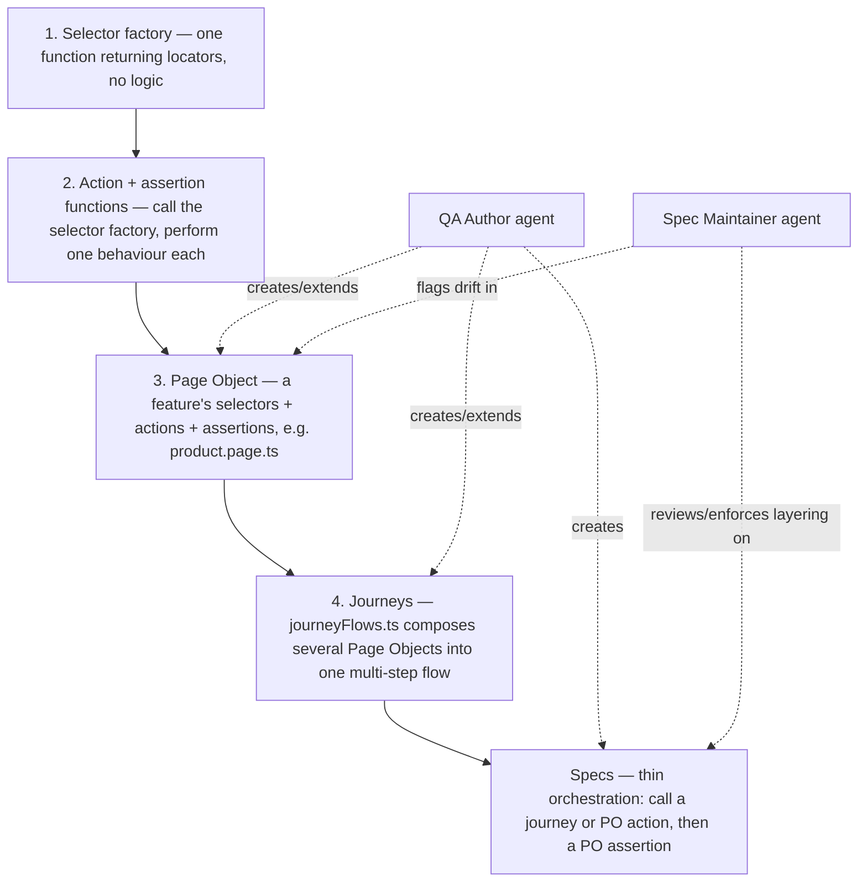

# playwright-qa-toolkit

A portable Playwright QA framework: a pre-built set of standard ecom Page Objects (login,
registration, listing, product, cart, checkout, account, data layer) and the cross-page journeys
that compose them, test/accessibility/performance reporting, and a set of QA workflow agents
(authoring, validation, regression triage, release management, spec maintenance) available in
both GitHub Copilot and Claude Code formats.

Extracted from real production ecom projects and generalized to work on any stack — porting to a
new project means swapping `data-testid` selectors and brand copy, not rewriting the flow logic.

This repo is a public overview only. **The working toolkit (code, Page Objects, agents, scripts)
lives in a private repository.** See "Request access" below.

## The strategy

Everything in the toolkit is built bottom-up, in four layers — each layer only depends on the one
below it, which is what makes porting to a new project a locator swap instead of a rewrite.

1. **Functions first** — selector factory, then action functions, then assertion functions, in
   that order, for every Page Object.
2. **Page Objects are one feature, not one ticket** — a new capability is a new function in the
   right file, not a new file per ticket.
3. **Journeys compose Page Objects, never the other way round** — multi-page flows (sign-in →
   add-to-cart → checkout) live once, reused everywhere.
4. **Folder structure mirrors this** — one feature-area folder per Page Object, plus a mandatory
   `_global/` folder for site-wide checks (404 page, responsive shell).
5. **Agents enforce the layering, they don't replace it** — QA Author creates within it, Spec
   Maintainer reviews existing specs against it and flags drift.

## What's included

- Standard ecom Page Objects: login, registration, product listing/search, product detail, cart,
  checkout, account, and a data-layer/analytics (GA4 ecommerce events) Page Object
- `journeyFlows.ts` composing full happy paths: sign-in, add-to-cart, guest checkout
- A required `_global/` test folder (404 page + responsive shell) proven across multiple real
  ecom projects
- Accessibility (axe) and performance (Lighthouse-style) reporting wired into the test run
- Nine QA workflow agents — authoring, validation, regression triage, spec maintenance, release
  management, skip auditing, CSS parity, framework diagnostics, pipeline health — in both GitHub
  Copilot and Claude Code formats
- A one-command setup script that fills in every project-specific placeholder across the whole
  toolkit in one pass

## Request access

The working repository is private. To get access, contact **Sherif Opeloyeru** directly.
